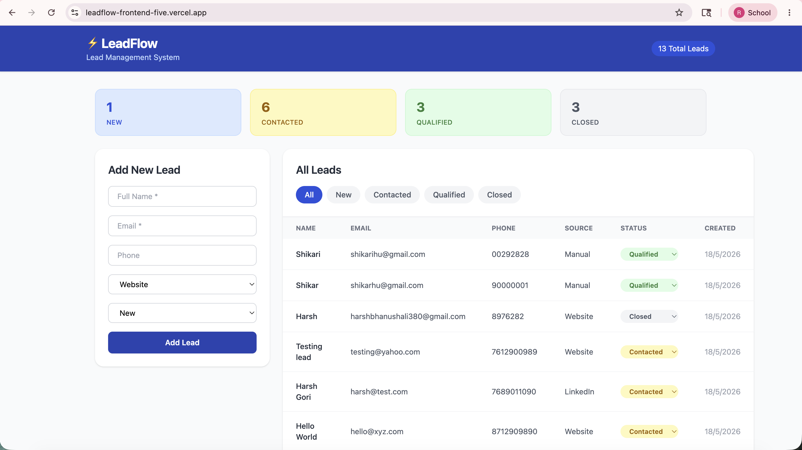

# LeadFlow — Frontend

A full-stack lead management dashboard built with React, Vite, and Tailwind CSS.

## Live App
[https://leadflow-frontend-five.vercel.app](https://leadflow-frontend-five.vercel.app)

## Features
- Submit new leads via a clean form
- Dashboard table with all leads
- Filter leads by status (New / Contacted / Qualified / Closed)
- Inline status update — change status directly from the table row
- Stats bar showing live lead counts per status
- Fully responsive — works on mobile and desktop
- Instant UI updates without page refresh

## Tech Stack
- **Framework:** React (Vite)
- **Styling:** Tailwind CSS
- **API:** Axios/Fetch → LeadFlow Backend REST API
- **Deployment:** Vercel

## Screenshots



##  Local Setup

```bash
# Clone the repo
git clone https://github.com/Rashiiibhanushali/leadflow-frontend.git
cd leadflow-frontend

# Install dependencies
npm install

# Create .env file
VITE_API_URL=https://leadflow-backend-jxdn.onrender.com

# Run the app
npm run dev
```

## 🔗 Backend
[leadflow-backend](https://github.com/Rashiiibhanushali/leadflow-backend)